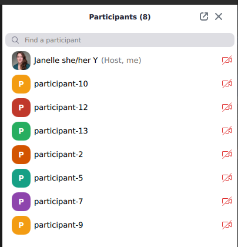

# Zoom Participant Factory

This directory contains the definition of an API that manages requests to add participants to a Zoom meeting.

## Behaviors
* Processes requests to create Kubernetes Pods that join a Zoom meeting without audio or video
* A single user may not ask for more than 15 participants in one request
* A single user may not have more than 3 active requests concurrently

## Prerequisites
* Python 3.8
* Docker
* Kind
* Kubectl

## /participant
This directory contains a Python script that connects to a Zoom meeting using Selenium. It also contains a Dockerfile such that this script can be run inside a container.

### Usage
```shell

export HOSTNAME=participant-A # used as Zoom display name
export ZOOM_MEETING_ID=
export ZOOM_MEETING_PASSCODE=
export ZOOM_SESSION_LENGTH_SECONDS=30

# manually
python3 participant.py

# Docker
export DOCKER_REPO=localhost:5001|dockerhub|ECR
make docker_build
make docker_run
```

## /api
This directory contains the definition of an API built on [pocketbase](https://pocketbase.io/) that managages users
and requests to add participants to a Zoom meeting.

## Local Cluster

To manage the Kind cluster:
```shell
make kind_create_cluster
...
make kind_delete_cluster
```


To see the Python script connecting to a Zoom meeting inside Kubernetes pods:

```shell
export DOCKER_REPO=localhost:5001|dockerhub|ECR
export PARTICIPANT_TAG=latest
make docker_build
make kind_push_image
make kind_new_participant
kubectl get jobs -A
kubectl get pods -A
kubectl logs ...
make kind_delete_participant
```

To see the API managing requests for new participants:

```shell
export DOCKER_REPO=localhost:5001|dockerhub|ECR
export PARTICIPANT_TAG=latest
make docker_build
make kind_push_image

cd api
export API_TAG=latest
make docker_build
make kind_push_image

# OR start in the cluster
cd ../
scripts/deploy.sh
cd api

# start locally
make api_run


source scripts/convenience.sh
export API=localhost:8090
# log in to Admin UI at localhost:8090
# create user with email and password

export API_EMAIL=user@example.com
export API_PASSWORD=abc

get_new_token

export API_TOKEN=...

# replace with real meeting details, better without a waiting room
export ZOOM_MEETING_ID=123
export ZOOM_MEETING_PASSCODE=xyz

create_participant_request $ZOOM_MEETING_ID $ZOOM_MEETING_PASSCODE 20 2

kubectl get jobs -A
kubectl get pods -A
kubectl logs ...
```


## Demo Video

Click the image below

[](https://drive.google.com/file/d/11rK04qPdiUtScPDvcP3tykUNEqBBg9lA/view?usp=sharing)